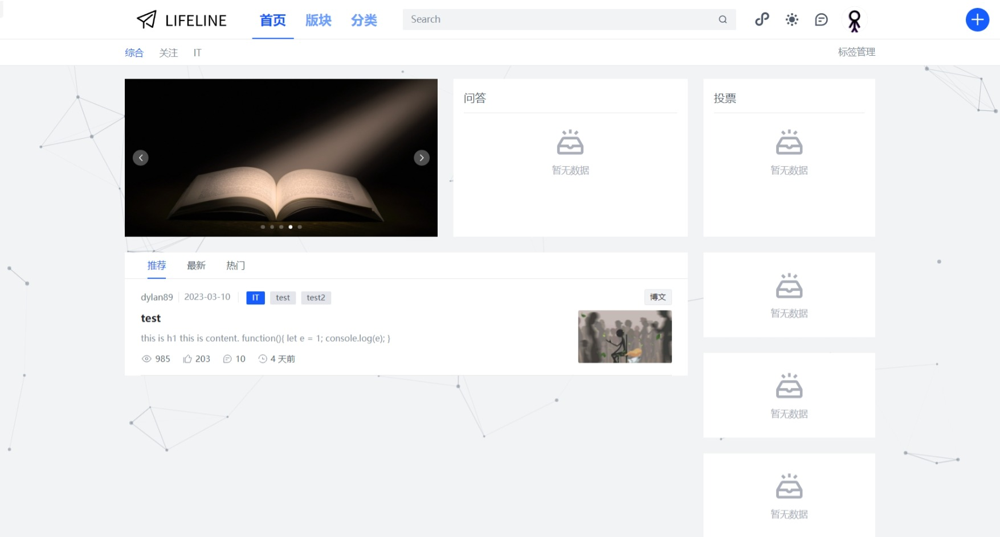
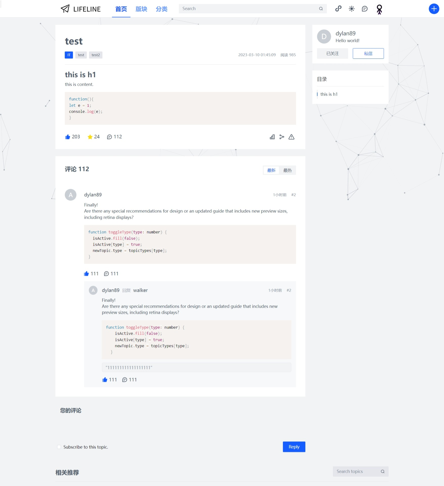

# 职涯社区

一个仿掘金的大型社区，汇集各大行业的论坛，并且包含博客、帖子、问答、视频、画册、投票六种话题类型。

## 技术架构
### 开发环境

- 语言：JavaScript + TypeScript
- IDE：VScode

### 前端

- 框架：Vue 3
- 构建工具：Vite
- UI组件库：Arco Deign
- 前后端交互：Axios
- 状态管理库：Pinia
- 富文本编辑器：TinyMCE
- CSS 预处理器：SCSS

### 后端
- 环境：Node.js
- 框架：Egg.js
- 页面框架：Arco Pro Vue
- 数据库：MySQL

## 项目进展

### 注册登录✔️

### 游客模式

### HEADER✔️

LOGO、首页、版块、分类、搜索、主题切换、消息、用户、新建话题

### 首页⭕

- 标签导航✔️
- 轮播图——视频、画册、广告位✔️
- 问答列表
- 投票列表
- 帖子、博文列表✔️
- 侧边栏——话题推荐、数据展板、广告、Footer

### 版块

帖子、博文✔️、问答、视频、画册、投票

### 分类✔️

- 行业分类
- 单个分类页
- 单个标签页

### 消息

- 评论和@
- 新增粉丝
- 赞和收藏
- 私信
- 系统通知

### 用户中心

- 个人信息
- 动态
- 收藏
- 关注
- 帖子、博文、问答、视频、画册、投票

### 设置中心

- 资料设置
- 账号设置
- 消息设置
- 外观设置
- 屏蔽管理

### 搜索

- 搜索历史✔️
- nav
- 搜索结果列表

### 新建话题✔️

### 交互功能
点赞✔️
收藏✔️
评论✔️
分享
关注
私信
